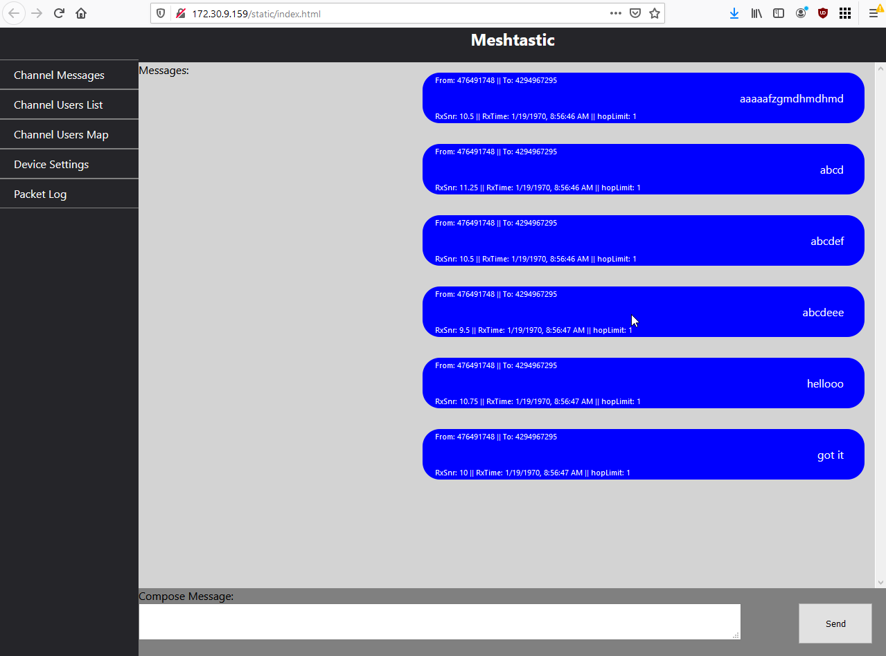

# Meshtastic-web

This is a ReactJS based front-end designed to be served by the [Meshtastic-device](https://github.com/meshtastic/Meshtastic-device) project's embedded webserver.

This project imports the [Meshtastic.js library](https://github.com/meshtastic/meshtastic.js) for communication with the device

